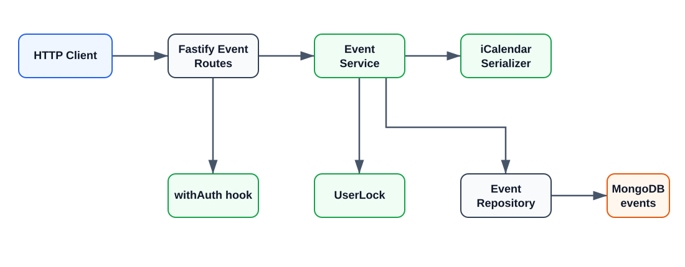

# Task 1: Customizable Timetable Event Service

This document describes the implementation of the backend test:Custom Events, including the code structure, data model, API contract, authorization model, and key business rules.

## 1. Requirement coverage

Task 1 requires the backend service to support:

1. Basic CRUD for custom events, with a suitable data model and API.
2. A minimal authorization handler so multiple users can access only their own events.
3. Additional functionality related to the core feature.
4. Documentation of the implementation and API design.
5. Containerization with Docker or an equivalent approach.

The implementation covers these requirements as follows:

| Requirement | Implementation |
| --- | --- |
| CRUD | `/event/` and `/event/:id` provide create, list, get, update, and delete operations. |
| User isolation | Bearer authentication resolves each request to `request.user.username`; all event queries include an `owner` condition. |
| Validation | TypeBox request schemas plus service-level date, time-range, and title validation. |
| Business rule | Events belonging to the same user cannot overlap; adjacent events are allowed. |
| Concurrent writes | A per-user in-process queue plus optimistic locking with the PATCH `version` field. |
| Additional features | `/event/export.ics` exports RFC 5545 iCalendar data; list endpoints support title and time-range filters. |
| Documentation and discovery | This document, Swagger at `/documentation`, and Scalar at `/reference`. |
| Containerization | `Dockerfile` and `compose.yaml` run the API and MongoDB as separate services. |

## 2. Overall architecture

The project uses Fastify, TypeScript, and MongoDB. Event functionality is split into an HTTP layer, an application/service layer, and a persistence layer:



### 2.1 Responsibilities by layer

- `src/routes/event/index.ts` defines routes, mounts the authenticated scope, calls the service, converts `ObjectId` and `Date` values to API formats, and maps domain errors to HTTP statuses.
- `src/event/event-schema.ts` defines TypeBox request and response schemas. These schemas are used for Fastify validation and OpenAPI generation.
- `src/event/event-service.ts` contains business rules: title normalization, date parsing, time-range validation, overlap checks, per-user serialization, and version-conflict handling.
- `src/event/event-repository.ts` contains MongoDB queries and writes. Every operation addressed by an event ID includes `owner` in its filter.
- `src/event/event.ts` defines the MongoDB `EventDocument` type.
- `src/event/ical-service.ts` serializes events as CRLF-terminated RFC 5545 text, including text escaping and UTF-8 line folding.
- `src/event/user-lock.ts` queues asynchronous work for one user while allowing different users to proceed independently.
- `src/plugins/auth.ts` provides the `withAuth` scope and the typed `request.user` property, and performs Bearer-token authentication.
- `src/plugins/init-mongo.ts` resolves the MongoDB URI, connects to MongoDB, and creates the `events` collection and index.

Fastify autoloads plugins and routes from `src/plugins` and `src/routes`. The event route is mounted under `/event`, so the route plugin's `/` handler is exposed as `/event/`.

## 3. Data model

Documents in the MongoDB `events` collection have the following shape:

| Field | Type | Required | Description |
| --- | --- | --- | --- |
| `_id` | `ObjectId` | Yes | MongoDB primary key; returned by the API as the 24-character hexadecimal `id`. |
| `owner` | `string` | Yes | Set from the authenticated user's `username`; clients cannot choose it. |
| `title` | `string` | Yes | Trimmed before storage; 1–200 characters. |
| `startsAt` | `Date` | Yes | Event start time, stored as an absolute timestamp. |
| `endsAt` | `Date` | Yes | Event end time; must be later than `startsAt`. |
| `description` | `string` | No | Maximum 5,000 characters. |
| `venue` | `string` | No | Maximum 500 characters. |
| `version` | `integer` | Yes | Starts at 1 and increments after every successful update. |
| `createdAt` | `Date` | Yes | Creation timestamp. |
| `updatedAt` | `Date` | Yes | Timestamp of the latest update. |

Startup creates the `{ owner: 1, startsAt: 1 }` index. List results are sorted by `startsAt` ascending and then `_id` ascending, giving stable ordering when events share a start time.

### Overlap rule

Two intervals overlap when:

```text
existing.startsAt < candidate.endsAt
AND existing.endsAt > candidate.startsAt
```

Consequently, `10:00–11:00` and `11:00–12:00` are adjacent rather than overlapping. Containment, partial intersection, and identical intervals are rejected. The check is always limited to one `owner`, so Bob's events do not block Alice's events.

## 4. API design

### 4.1 General conventions

- Local base URL: `http://localhost:3000`.
- Every event endpoint requires `Authorization: Bearer <token>`.
- Sample development users are `alice-dev-token` and `bob-dev-token`. Replace the sample tokens in `src/auth/users.ts` before a real deployment.
- Request times use ISO 8601 `date-time` strings. Response times are emitted with `Date.toISOString()`.
- `owner` is derived by the server from the token and is not accepted from the request body.

### 4.2 Event response object

Successful responses use this JSON shape:

```json
{
  "id": "66f000000000000000000001",
  "owner": "alice",
  "title": "Project meeting",
  "startsAt": "2026-09-24T10:00:00.000Z",
  "endsAt": "2026-09-24T11:00:00.000Z",
  "description": "Discuss the release",
  "venue": "Room 101",
  "version": 1,
  "createdAt": "2026-09-24T09:00:00.000Z",
  "updatedAt": "2026-09-24T09:00:00.000Z"
}
```

`description` and `venue` are omitted when they are not stored.

### 4.3 CRUD endpoints

Available in localhost:3000/reference or localhost:3000/documentation

#### `POST /event/` — Create an event

Request body:

```json
{
  "title": "Project meeting",
  "startsAt": "2026-09-24T10:00:00Z",
  "endsAt": "2026-09-24T11:00:00Z",
  "description": "Discuss the release",
  "venue": "Room 101"
}
```

Processing flow: authenticate the user → validate and normalize the input → check for an overlapping event owned by that user → insert the document with `version = 1` and timestamps.

| Status | Meaning |
| --- | --- |
| `201` | Created; returns the event object. |
| `400` | Invalid schema, date, title, or time range. |
| `409` | The event overlaps an existing event owned by the user. |
| `500` | The database write failed. |

#### `GET /event/` — List the current user's events

Optional query parameters:

| Parameter | Description |
| --- | --- |
| `title` | Case-insensitive substring search on the title; trimmed and limited to 1–200 characters. |
| `from` | Includes events where `endsAt > from`. |
| `to` | Includes events where `startsAt < to`. |

When both `from` and `to` are supplied, `from` must be earlier than `to`. Time filtering uses interval intersection, so an event that began before the query window but continues into it is included. The response is an array sorted by start time.

#### `GET /event/:id` — Get one event

Path parameter:

| Parameter | Description |
| --- | --- |
| `id` | The event ID as a MongoDB `ObjectId` string. |

Processing flow: authenticate the user → validate and parse the ID → find the event with `{ _id: id, owner: currentUser }` → serialize the MongoDB document as the API response object.

| Status | Meaning |
| --- | --- |
| `200` | Returns the requested event. |
| `400` | The event ID is not a valid MongoDB `ObjectId`. |
| `404` | The event does not exist or is owned by another user. |

The API uses `404` for both missing and foreign events so it does not reveal whether an event belonging to another user exists.

#### `PATCH /event/:id` — Partially update an event

The request body must include the current `version`; all other event fields are optional:

```json
{
  "version": 1,
  "title": "Updated meeting",
  "startsAt": "2026-09-24T10:30:00Z"
}
```

This is a partial-update example. `version` is required; the remaining fields are optional and may be supplied in any combination: `title`, `startsAt`, `endsAt`, `description`, and `venue`. The example changes only the title and start time. At least one event field must be included in addition to `version`.

Update flow:

1. Load the event owned by the current user.
2. Compare the request `version` with the stored version; reject a mismatch.
3. Merge omitted time fields with their current values and revalidate the time range.
4. Check the new interval while excluding the event itself.
5. Execute an atomic MongoDB update filtered by `{ _id, owner, version }`, incrementing the version with `$inc`.

| Status | Meaning |
| --- | --- |
| `200` | Updated; returns the new event version. |
| `400` | Invalid ID, version, field, date, time range, or an empty update. |
| `404` | The event does not exist or is not owned by the current user. |
| `409` | The new interval overlaps another event, or the supplied version is stale. |

#### `DELETE /event/:id` — Delete an event

Deletion uses `{ _id, owner }` as the filter. A successful deletion returns `204 No Content`. A missing or foreign event returns `404`.

### 4.4 Additional feature: iCalendar export

#### `GET /event/export.ics`

This endpoint accepts the same `title`, `from`, and `to` filters as the list endpoint and exports only events owned by the authenticated user.

Response characteristics:

- Status `200`.
- `Content-Type: text/calendar; charset=utf-8`.
- `Content-Disposition: attachment; filename="events.ics"`.
- `Cache-Control: private, no-store`, preventing shared caching of calendar data.
- Each event becomes a `VEVENT` with UID `<ObjectId>@event-api`.
- Times are emitted in UTC. Backslashes, newlines, commas, and semicolons are escaped according to RFC 5545.
- Long lines are folded by UTF-8 byte length: the first physical line is at most 75 octets and continuation lines start with one space.

## 5. Authentication and user isolation

`withAuth` creates an encapsulated Fastify scope. Routes inside the scope run an `onRequest` authentication hook first. After successful authentication, `{ username, name }` is assigned to `request.user`. The route schema is also augmented with the authentication responses in the OpenAPI document.

Authentication flow:

1. Read the `Authorization` header.
2. Require the `Bearer <token>` format. A missing header returns `401`; a malformed header or unsupported scheme returns `400`.
3. Hash the token with SHA-256 and compare it with the precomputed token hashes using `timingSafeEqual`.
4. Pass only the normalized `username` and `name` to the business layer; the original token is not exposed there.

All user-scoped repository reads, updates, and deletes include `owner` in their filters. A user therefore cannot read or modify another user's event by guessing its ID. Missing, foreign, or deleted events are exposed as `404 Event not found`.

## 6. Concurrency and consistency

Create and update operations for one user are queued by `UserLock.run(owner, ...)` within a single Bun/Node process. This keeps overlap detection and writes together for concurrent requests handled by that process.

PATCH also uses optimistic locking. The MongoDB update filter contains the version read by the client, and a successful update uses `$inc: { version: 1 }`. If two requests use the same version, only one can match and commit; the other receives `409 Event was modified by another request`.

The current lock is process-local and cannot coordinate multiple API replicas.

## 7. Error handling and input validation

- TypeBox validates JSON bodies, query strings, and path parameters before handlers run.
- The service layer repeats business validation so direct service callers cannot bypass the rules.
- Domain failures use `EventServiceError`; the route layer maps these errors consistently to `400`, `404`, `409`, or `500`.
- Title search escapes regular-expression metacharacters before sending the query to MongoDB. A search for `.*` is therefore literal rather than an arbitrary-match expression.
- Dates pass the schema's `date-time` validation, are converted to `Date` objects in the service, and are checked so `startsAt < endsAt`.

## 8. Startup, database, and containerization

- When the API runs from the host, `.env.example` documents a host-accessible MongoDB URI (`mongodb://localhost:27018/usthing`). Without `MONGO_URI`, development and test runs start `mongodb-memory-server`; the in-memory server is stopped when the application closes.
- Docker Compose uses `${MONGO_URI:-mongodb://mongodb:27017/usthing}` so the API connects to the MongoDB service by its Compose hostname. `.env.compose.example` provides the recommended Compose values; the defaults in `compose.yaml` keep the stack runnable when no conflicting project `.env` is present.
- `NODE_ENV`, `FASTIFY_ADDRESS`, and `FASTIFY_PORT` are configurable through the Compose environment file.
- `Dockerfile` is based on `oven/bun:1.4.2`, installs only production dependencies, copies `src`, and exposes port 3000.
- `compose.yaml` starts MongoDB and the API as separate services. MongoDB has a healthcheck; the API waits for MongoDB to become healthy and exposes `/health` for its own healthcheck.

## 9. Test coverage

`test/routes/event-overlap.test.ts` uses a real in-memory MongoDB instance to cover:

- CRUD lifecycle and status codes.
- Title, date, and time-range validation.
- Identical, containing, and partially overlapping intervals, plus adjacent intervals.
- Concurrent creation, concurrent PATCH requests, and stale versions.
- Alice/Bob owner isolation.
- Title search, time-window filtering, and stable ordering.
- iCalendar owner filtering, text escaping, download headers, and UTF-8 line folding.
